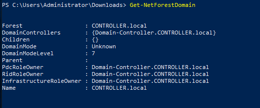
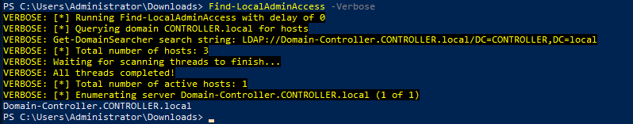

# DomainEnumeration

## Enumeration with Powerview
Powerview[https://github.com/PowerShellMafia/PowerSploit/blob/dev/Recon/PowerView.ps1] is a Powershell script, which is used for enumerating a domain after you have already gained a shell in the system. Now download the powerview.ps1 script in windows machine, and import it.

Get current Domain

Get domain SID for the current domain

Get domain controllers for current domain

Get domain policy for the current domain

Get a list of users in the current domain

Get list of all properties for users in the current domain

Search for a particular string in a user's attribute

Get a list of computers in the current domain

Get all the groups in the current domain

List all local groups in machine

Find shares on hosts in current domain.

Find sesitive files on computers in current domain
``Invoke-FileFinder -Verbose``

Get all filservers of the domain
``Get-NetFileServer``

Get list of GPO in current domain

Get OUs in a domain

Get details about the current forest

Get all domains in the current forest

Get all global catalogs for the current forest

Find all machines on the current domain where the current user has local admin access

Find local admins on all machines of the domain.

Find computers where a domain admin has sessions

To confirm admins access

**AD Module**

Get current Domain

Get domain SID for the current domain

Get domain controllers for current domain

Get a list of users in the current domain

Get list of all properties for users in the current domain

Get a list of computers in the current domain

Get all the groups in the current domain

Get list of GPO in current domain

Get details about the current forest

Get all domains in the current forest

Get all global catalogs for the current forest

